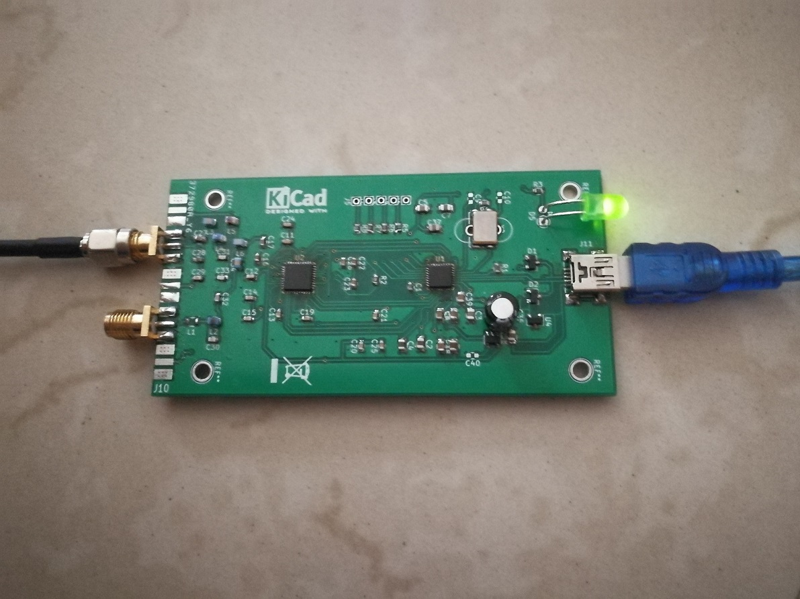
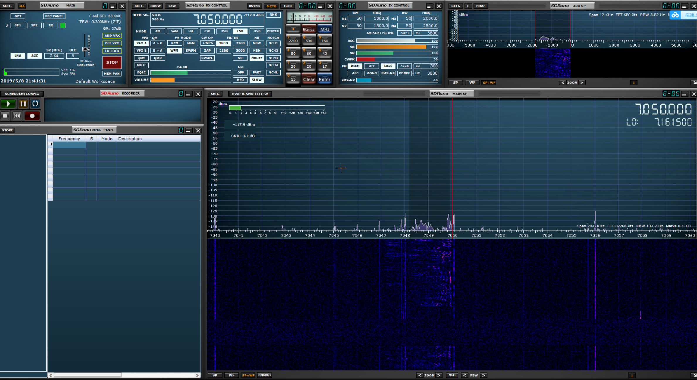

this is an Software Define Radio receiver PCB project base on msi2500 and msi001. use kicad to view it

这是一个基于msi2500 和 msi001的软件无线电PCB工程项目， 使用kiCAD浏览此工程

如果需要PCB打样，把gerber目录下的文件发给PCB加工厂即可

Send gerbar files to PCB factory . you'd better to use SMT

建议叫工厂SMT贴片，手动焊接容易太多bug

软件使用SDRuno（选SDRPlay）

software compatible with SDRplay

使用效果

